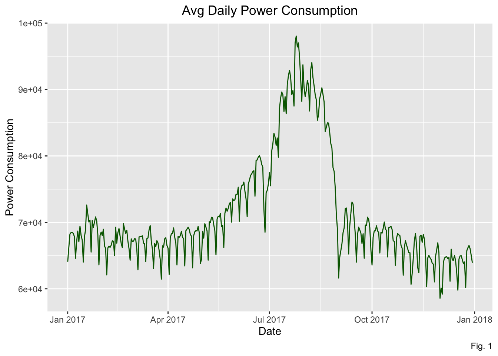
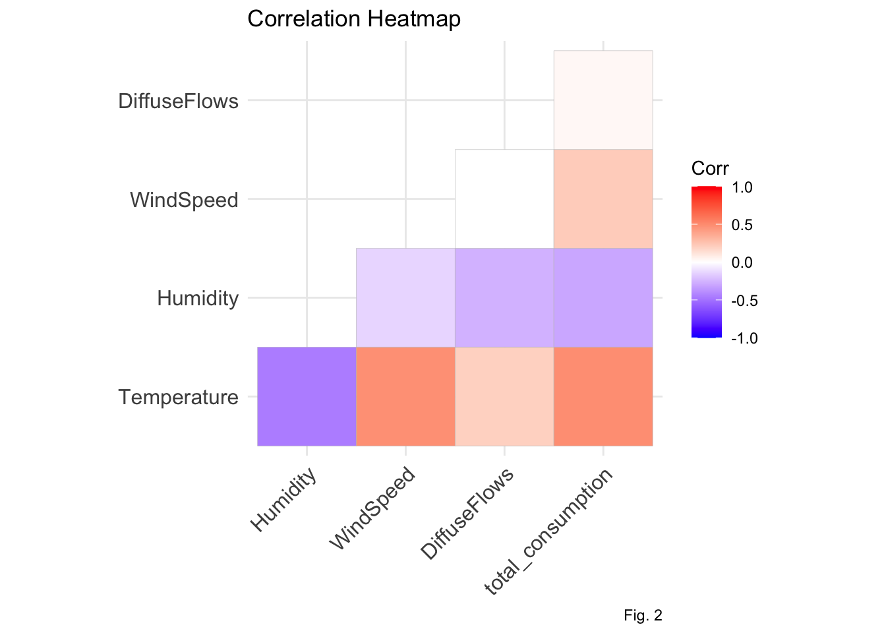
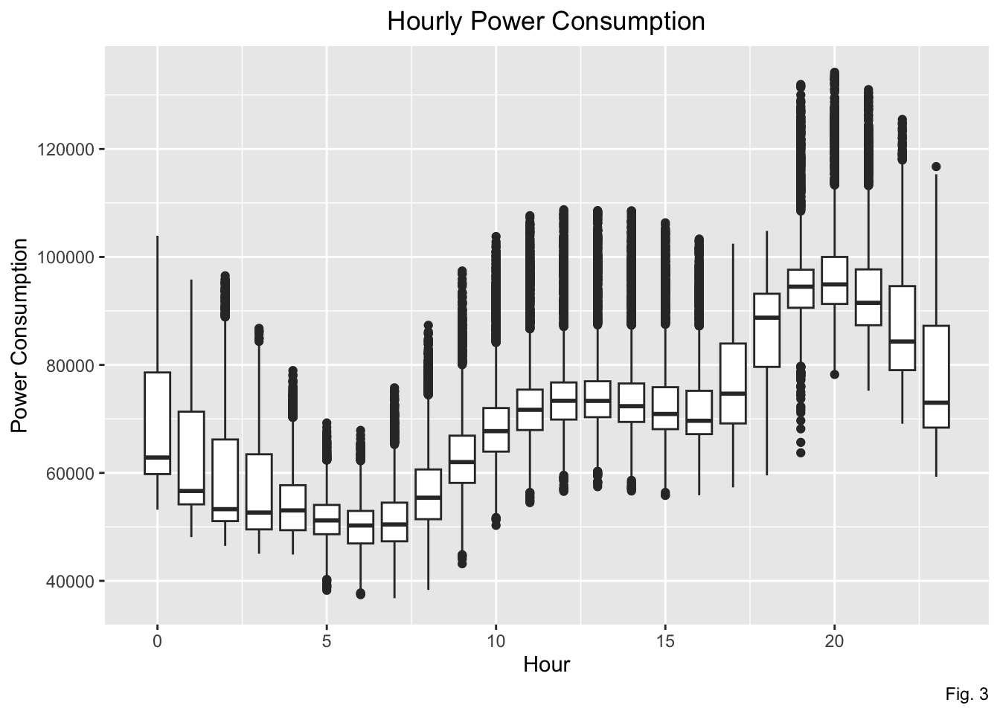
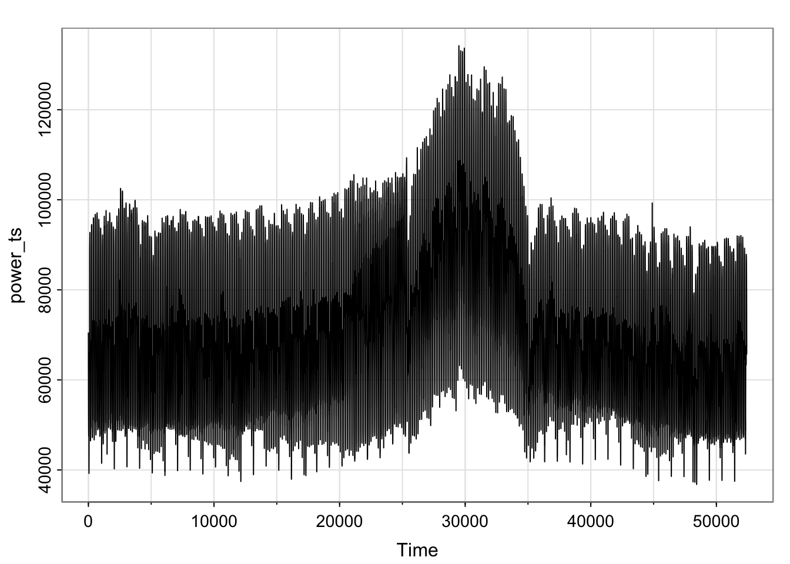
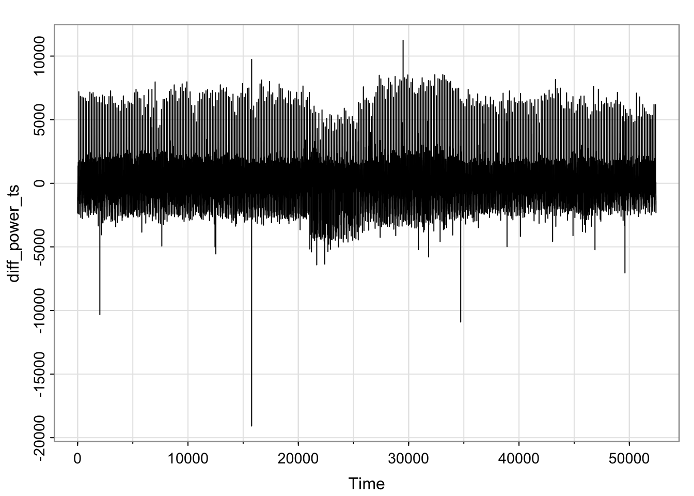

# Power Consumption Forecasting in Tetouan, Morocco

## Project Overview

This project analyzes and forecasts power consumption in Tetouan, Morocco using time series models. The analysis explores how weather events and seasonal/daily patterns influence consumption trends across three zones in the region.

## Team Members

- **Jaehyung Kim**
- **Karina Grewal**
- **Steve Liang**

---

## Data Description

The dataset contains power consumption measurements from Tetouan, Morocco, recorded from January 1st, 2017 to December 30th, 2017. The data was collected from [Amendis](https://www.amendis.ma/fr), the electricity distributor in the region, and obtained from [Kaggle](https://www.kaggle.com/datasets/fedesoriano/electric-power-consumption/data).

### Feature Variables

- **Temperature**: Measured in Celsius (°C)
- **Humidity**: Weather humidity
- **Wind Speed**: Wind speed
- **Diffuse Flows**: Represents amount of diffused solar radiation

*Note: We removed "General Diffuse Flows" as it accounts for radiation that bounces off nearby surfaces.*

### Response Variables

- **Zone 1 Power Consumption**: Power Consumption in Quads zone (kV)
- **Zone 2 Power Consumption**: Power Consumption in Smir zone (kV)
- **Zone 3 Power Consumption**: Power Consumption in Boussafou zone (kV)

All measurements were recorded at 10-minute intervals throughout the day. For this analysis, we aggregated power consumption across all three zones to create a comprehensive **total consumption** variable representing the overall power consumption in Tetouan.

---

## Preliminary Data Analysis and Visualization

### Average Daily Power Consumption

*Figure 1: Average Daily Power Consumption*

The average daily power consumption exhibits an overall trend that peaks during summer months, with a potential weekly seasonal pattern. The data is non-stationary, though variance appears constant when disregarding the overall trend.

### Correlation Analysis

*Figure 2: Correlation Heatmap*

The temperature variable shows moderate correlation with humidity, wind speed, and total consumption.

### Hourly Power Consumption Patterns

*Figure 3: Hourly Power Consumption*

A clear seasonal trend exists across hours of the day. Power consumption is lowest around 6am, increases throughout the day, peaks around 8pm, and then decreases again.

---

## Research Questions

This project aims to answer three key questions:

### 1. How accurately can we forecast power consumption using time series models?

We evaluate forecasting accuracy by implementing linear regression models and SARIMA models, comparing their performance using Root Mean Squared Error (RMSE). Variable selection is performed using AIC/BIC, with the introduction of dummy and lag variables to optimize forecasting performance.

### 2. Which weather event has the greatest influence on power consumption?

We analyze extreme weather conditions' influence on consumption patterns through:
- Cross-correlation analysis between variables
- Evaluation of absolute variable weights (if significant)
- Examination of lagged weather variables to understand how past weather events affect present power consumption

### 3. Are there seasonal or daily cycles in power consumption?

We use spectral analysis methods to identify underlying cyclical patterns, including:
- **Fast Fourier Transform**: Converts time series to frequency domain to identify dominant cycles
- **Periodogram**: Visualizes how power consumption varies with frequency
- **Wavelet Transform** (optional): Captures both frequency and time variations

---

## Analysis Methodology

### Data Preprocessing

The analysis began by transforming the raw data into a time series object and applying first-order differencing to address non-stationarity.

### Regression Models

Initial linear regression models were fitted with various polynomial terms and weather variables:

1. **Basic Linear Model**: Time, temperature, humidity, wind speed, and diffuse flows
2. **Polynomial Model**: Added polynomial terms up to degree 11
3. **Hourly Factor Model**: Included hour-of-day as a categorical variable

**Key Finding**: Even with extensive polynomial terms and hourly factors, residuals showed high correlation based on the Ljung-Box test. This indicated the need for a dynamic SARIMA model with regressors.

### SARIMA Model Development

Given the autocorrelated residuals from linear models, we developed Seasonal ARIMA (SARIMA) models to capture both seasonal and non-seasonal patterns.

#### Model Specifications

**Non-Seasonal Orders:**
- **p (AR order)**: 3 - PACF tails off after lag 3
- **d (Differencing)**: 1 - Required due to slow ACF decay
- **q (MA order)**: 2 - ACF tails off after lag 2

**Seasonal Orders:**
- **P (Seasonal AR)**: 0 - Seasonal PACF tails off
- **D (Seasonal Differencing)**: 1 - Required due to slow seasonal ACF decay
- **Q (Seasonal MA)**: 1 - Seasonal ACF cuts off at first seasonal lag
- **S (Season length)**: 24 - Hourly data with daily seasonality

*Figure 4: SARIMA Model Diagnostics (Part 1)*

*Figure 5: SARIMA Model Diagnostics (Part 2)*

### Final Model

The final SARIMA(3,1,2)×(0,1,1)₂₄ model with humidity as an external regressor provided the best balance of fit and forecast accuracy. This model:
- Accounts for daily seasonal patterns (24-hour cycles)
- Captures both short-term and long-term dependencies
- Incorporates weather effects through humidity as a significant predictor

---

## Spectral Analysis

To address the third research question regarding seasonal and daily cycles in power consumption, we conducted spectral analysis using Fast Fourier Transform (FFT) and periodogram methods. This analysis helps identify dominant frequencies and cyclical patterns in the data.

### Methodology

**Data Preparation:**
1. **Detrending**: Removed the mean and linear trend from the time series to ensure stationarity
2. **Windowing**: Applied a Hann window to reduce spectral leakage (boundary effects in FFT)
3. **FFT Computation**: Converted the time series from the time domain to the frequency domain

**Analysis Parameters:**
- **Sampling Rate**: 6 samples per hour (10-minute intervals)
- **Nyquist Frequency**: 3 cycles per hour (maximum detectable frequency)
- **Frequency Range**: 0 to 3 cycles/hour

### Enhanced FFT Power Spectrum

The spectral analysis revealed several significant findings:

**Normalization Approach:**
- **Decibel Scale**: Power values were converted to dB scale (10 × log₁₀(power/max_power)) to compress the dynamic range and make both strong and weak peaks visible
- **Relative Power**: Calculated as percentage of total power to quantify the importance of each frequency component

**Peak Detection:**
- **Signal-to-Noise Ratio (SNR)**: Peaks with SNR > 10 were identified as statistically significant
- **Noise Floor**: Calculated as the median power across all frequencies to establish a baseline for comparison

### Key Findings

#### 1. Dominant Daily Cycle
- **Frequency**: 1/24 cycles per hour (0.042 cycles/hour)
- **Period**: 24 hours
- **Significance**: This represents the expected daily pattern in power consumption, with peak usage in evening hours and low consumption during early morning hours

#### 2. Sub-Hourly Patterns
Several unexpected sub-hourly cycles were detected:
- **1.4 cycles/hour** (43-minute period)
- **2.0 cycles/hour** (30-minute period)
- **2.6 cycles/hour** (23-minute period)

These patterns may reflect:
- Equipment cycling patterns (HVAC, industrial machinery)
- Transit or commuter patterns at sub-hourly intervals
- Measurement artifacts or grid synchronization effects

#### 3. Weekly Seasonal Pattern
Analysis confirmed the presence of a weekly cycle (7-day period), consistent with different consumption patterns on weekdays vs. weekends.

### Window Function Comparison

**Hann Window vs. Flat-Top Window:**
- **Hann Window**: Provides better frequency resolution, making it easier to distinguish between closely spaced frequencies
- **Flat-Top Window**: Prioritizes amplitude accuracy, preserving the true power of all frequency components while broadening their appearance

The analysis used the Hann window as it better balances frequency resolution and amplitude accuracy for identifying consumption cycles.

### Periodogram Analysis

To validate the FFT results, we performed periodogram analysis:

**Peak-to-Baseline Ratio:**
- **Peak Magnitude**: Maximum power in the spectrum
- **Baseline Magnitude**: Average power in the noise region (last 20% of spectrum)
- **Ratio**: Peak magnitude / Baseline magnitude >> 1

The large peak-to-baseline ratio confirms that the dominant daily cycle is highly significant and not an artifact of noise.

### Signal Validation

**SNR Analysis for the 1.5-Hour Cycle:**
- **SNR > 3**: Indicates a likely real signal rather than noise
- **Exact Period**: ~1.5 hours (calculated from the strongest peak)
- **Interpretation**: This pattern may represent operational cycles in industrial or commercial consumers

### Implications

The spectral analysis provides complementary insights to the SARIMA model:

1. **Confirms Daily Seasonality**: The strong 24-hour cycle validates the choice of S=24 in the SARIMA model
2. **Sub-Daily Patterns**: Identifies additional cyclical patterns that may warrant further investigation
3. **Model Validation**: The frequency domain analysis supports the time domain findings from ACF/PACF plots
4. **Operational Insights**: Sub-hourly cycles suggest specific equipment or behavioral patterns that could be targeted for demand response programs

### Technical Notes

**Frequency-Period Relationship:**
- Frequency (f) = 1 / Period (T)
- A frequency of 1 cycle/hour corresponds to an hourly pattern
- A frequency of 1/24 cycles/hour corresponds to a daily pattern

**Decibel Scale Interpretation:**
- 0 dB: Maximum power (reference)
- -10 dB: 10× weaker than maximum
- -20 dB: 100× weaker than maximum
- -50 dB: 100,000× weaker than maximum

This logarithmic scale allows simultaneous visualization of both dominant and weak cyclical patterns that would otherwise be invisible on a linear scale.

---

## Results and Forecasting

### Model Performance

The SARIMA model successfully addressed the autocorrelated errors present in simpler linear models. While some residual patterns remain, the model significantly improved upon baseline approaches.

### Forecast Capability

The final model can forecast power consumption **5 hours ahead** with reasonable accuracy. This provides valuable information for:
- Grid management and load balancing
- Energy resource allocation
- Short-term operational planning

### Key Insights

1. **Seasonal Patterns**: Power consumption exhibits strong daily (24-hour) and weekly (7-day) cycles, confirmed by both time-domain (ACF/PACF) and frequency-domain (FFT) analysis
2. **Weather Impact**: Humidity emerged as a significant predictor, with temperature showing moderate correlation
3. **Time-of-Day Effects**: Consumption patterns vary systematically throughout the day, with peak usage in evening hours
4. **Sub-Hourly Cycles**: Spectral analysis revealed unexpected cyclical patterns at 43-minute, 30-minute, and 23-minute intervals
5. **Model Complexity**: Simple regression models were insufficient; SARIMA models were necessary to capture the complex temporal dependencies
6. **Frequency Domain Validation**: FFT and periodogram analysis confirmed the presence of statistically significant cycles, validating the SARIMA model's seasonal components

---

## Folder Structure

- **`src/`**: Contains analysis scripts and R Markdown files
- **`data/`**: Contains the power consumption dataset

---

## References

1. BasicSpectralAnalysisExample. (n.d.). Retrieved March 27, 2025, from https://www.mathworks.com/help/matlab/math/basic-spectral-analysis.html

2. 6.1 The periodogram. (n.d.). PennState: Statistics Online Courses. Retrieved March 27, 2025, from https://online.stat.psu.edu/stat510/lesson/6/6.1

3. Wavelet Transforms - An overview. (n.d.). ScienceDirect Topics. Retrieved March 27, 2025, from https://www.sciencedirect.com/topics/computer-science/wavelet-transforms

4. Electric Power Consumption Dataset. Kaggle. https://www.kaggle.com/datasets/fedesoriano/electric-power-consumption/data

---

## Technical Details

### Software Requirements

- R (version 4.0+)
- Required R packages:
  - `tidyverse`
  - `astsa`
  - `ggplot2`
  - `ggcorrplot`
  - `forecast`
  - `signal` 

### Data Specifications

- **Time Period**: January 1, 2017 - December 30, 2017
- **Sampling Frequency**: 10-minute intervals
- **Aggregation Level**: Hourly aggregates for final model
- **Total Observations**: 52,416 (10-minute intervals) → 8,736 (hourly aggregates)

---

## Future Work

Potential extensions of this project include:

1. **Extended Forecasting Horizon**: Developing models for longer-term forecasts (days/weeks ahead)
2. **Additional Weather Variables**: Incorporating more detailed weather data or extreme weather indicators
3. **Zone-Specific Models**: Analyzing consumption patterns separately for each zone
4. **Real-Time Implementation**: Deploying models for real-time forecasting and monitoring
5. **Machine Learning Approaches**: Comparing traditional time series methods with modern ML/DL techniques
6. **Sub-Hourly Pattern Investigation**: Further investigate the 43-minute and 30-minute cycles detected in spectral analysis through equipment logs and operational data
7. **Wavelet Analysis**: Implement wavelet transforms to capture time-varying frequency patterns and identify when certain cycles become more or less prominent
8. **Cross-Validation of Spectral Findings**: Validate detected frequency components using time-domain filtering and cross-correlation with operational schedules

---

